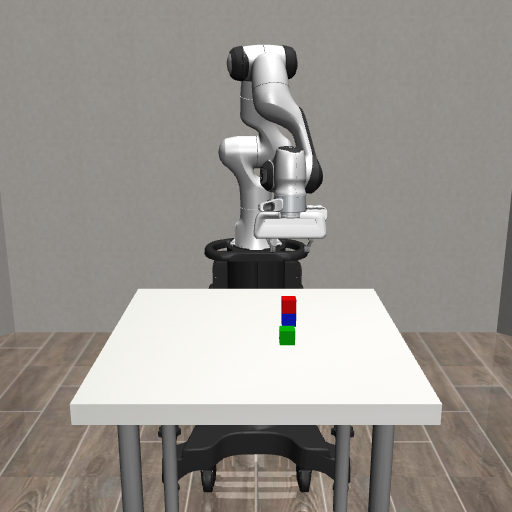

# 桌面机械臂 VLM / π0.5 实验台

Panda 机械臂 + 桌面三色积木 + 正面/腕部相机。用中文看图问答，或者让 Qwen3-VL 调用抓取、摆放、堆叠技能，并在浏览器查看结果。

页面提供 **π0.5 原始权重 · 直接动作控制**：根据双相机和语言指令直接预测并执行动作，不调用抓放技能。原始版本采用 LIBERO 微调权重；在这套自定义三色积木场景的早期抓取测试中未成功，见 [π0.5 初次实测](reports/pi05/README.md)。场景专用 LoRA 的独立测试见下方报告。

四任务示范采集与 LoRA 监督微调见 [详细实验报告](reports/LoRA四任务微调报告.md)。保存 `adapters/tabletop-four-v1/best` 后重启服务，会新增“π0.5 LoRA · 红绿蓝抓取与回位”选项；原始权重仍可单独选择。也可通过 `TABLETOP_PI05_LORA` 指定增量权重目录。注意该 LIBERO 配置 `discrete_state_input=False`：状态虽然在接口中保留，模型当前并不直接编码本体状态。

**Qwen 模式的能力边界**：VLM 接收相机 RGB 图像、用户指令和已执行技能记录。默认只用正面图片；勾选“同时使用腕部相机提问模型”后，会同时输入两张标明视角的图片，每次动作后也按本轮选项重新观察。默认左右仍按正面视角解释。技能控制器使用仿真物体位置，通过 OSC 控制、夹爪接触和物理仿真执行动作；没有瞬移、焊接物体或把答案坐标交给模型。这条技能链路不是端到端 VLA，也不代表真实机器人能力。



已完成远程验收：抓取、放置、堆叠各 **19/20**；视觉问答 **28/30**；中文指令解析 **20/20**，闭环操作完成 **18/20**。这是固定开发用例的结果，详情和失败记录见 [验收报告](reports/README.md)。

上述分数来自初版单正面相机评测；新增的可选腕部相机模式单独验证输入与问答功能，不沿用这些分数作为双相机表现。

这些分数也不适用于 π0.5；下面的 VLM 能力说明和五技能上限仅针对 Qwen 模式。

## 环境与安装

在远程 Linux / NVIDIA GPU 主机安装和运行；本地只编辑代码和打开浏览器。测试环境使用 Python 3.11、robosuite 1.5.2、MuJoCo 3.3.7、PyTorch 2.11（CUDA 13.0）和 Transformers 4.57.6。需要兼容的 NVIDIA 驱动、EGL 和 `uv`。

```bash
git clone https://github.com/zweiyao/tabletop-vla-playground.git
cd tabletop-vla-playground
bash scripts/setup.sh
.venv/bin/python scripts/download_model.py
TABLETOP_GPU=0 bash scripts/run.sh
```

模型固定为 `Qwen/Qwen3-VL-8B-Instruct`，revision `0c351dd01ed87e9c1b53cbc748cba10e6187ff3b`，BF16 / SDPA。默认从 `hf-mirror.com` 下载，可通过 `HF_ENDPOINT=https://huggingface.co` 使用官方端点。下载器读取清单，按未下载文件核算空间，保留 8 GiB 余量；权重约 17.5 GB，依赖另外占用空间。

服务仅监听远程 `127.0.0.1:7860`。在本地建立转发后打开 <http://localhost:7860>：

```bash
ssh -N -L 7860:127.0.0.1:7860 -o IdentitiesOnly=yes \
  -i ~/.ssh/zhangweiyao_ssh zhangweiyao@aigc
```

启动器要求所选 GPU 已用显存不超过 512 MiB，模型与 EGL 渲染绑定同一张物理卡。若卡被占用，通过 `TABLETOP_GPU` 指定其他空闲卡。不要同时启动多个使用同一张卡的实例。运行测试前先停止网页服务。

## 使用

- 问答：“桌上有哪些颜色的积木？”、“红色在蓝色左边还是右边？”
- 抓取：“抓起绿色积木”。抓起后保持夹持，下一条可要求放下。
- 放置：“把红色积木放到左侧区域”。`left` / `center` / `right` 均按正面相机视角。
- 堆叠：“把红色积木叠在蓝色积木上”。
- 每轮最多五个技能，每次执行后重新看图；失败或点击停止后终止本轮。用“重置场景”恢复初始状态。

每个交互保存到 `runs/<UTC时间>/`，包含输入、模型原始输出、技能结果、耗时、观察图片和操作视频。`runs/` 不提交到 Git。网页是经 SSH 访问的单用户共享场景，不提供多用户场景隔离。

## 可替换接口

### π0.5 部署和使用

在页面“使用模型”选择 **π0.5 原始权重 · 直接动作控制** 或 **π0.5 LoRA · 红绿蓝抓取与回位**，点击 **启动 π0.5**，等待运行状态显示已启动，再输入动作指令并发送。按钮随后变为 **关闭 π0.5**，点击可停止当前动作并释放该模型显存。发送不会自动加载、重启或更换权重；更换权重需先关闭再启动。切换模式仍会重置场景，但不改变已加载的模型。

默认执行最多 300 个仿真控制步，可调整到 50–1000 步。**停止**只结束当前动作，正常情况下保留已加载模型，下一条可直接发送。模型每次预测 10 步，只执行前 5 步后重新观察。20 Hz 指仿真控制频率，推理等待不推进仿真。达到步数上限不会自动判定任务成功。

中文指令先由 Qwen 进行一次纯文本英译，随后全部机械臂动作由 π0.5 生成。问答继续使用 Qwen 模式。π0.5 固定使用 `agentview` 斜视相机和腕部相机；“使用腕部相机提问”开关仅影响 VLM。网页仍显示正面和腕部画面，模型实际输入图片保存在每轮日志中。

当前远程部署复用相邻 `simulation` 目录内已有的环境和权重，通过独立子进程隔离与 Qwen 的依赖；不启动旧训练。两个模型和渲染共用 `TABLETOP_GPU` 指定的一张卡，仅点击启动按钮才加载 π0.5。没有重新下载 7.47 GB 权重。主项目的 `setup.sh` 只安装 VLM 环境，不会自动安装下面的可选 π0.5 运行时。

可通过启动前的环境变量指定已准备好的资源：

```bash
export TABLETOP_PI05_ROOT=/path/to/simulation
export TABLETOP_PI05_PYTHON="$TABLETOP_PI05_ROOT/.venv/bin/python"
export TABLETOP_PI05_CHECKPOINT="$TABLETOP_PI05_ROOT/checkpoints/RLinf-Pi05-LIBERO-SFT"
TABLETOP_GPU=0 bash scripts/run.sh
```

所需资源：

- [RLinf](https://github.com/RLinf/RLinf) checkout 位于 `$TABLETOP_PI05_ROOT/repos/RLinf`，已验证 commit `db66ac56d1aa4a9c8441c4026e4212b21811970d`。
- 独立 Python 环境包含 `rlinf-openpi==0.1.1`、PyTorch `2.11.0+cu130`、Transformers `4.57.6` 及 RLinf/openpi 要求的 Transformers 补丁。不能只在 Qwen 环境里安装普通 openpi 后混用。
- LoRA 训练/加载另需该独立环境内的 `peft==0.21.0`、`safetensors==0.8.0`；完整已验证版本见 [环境记录](reports/lora/environment.json)。
- [RLinf/RLinf-Pi05-LIBERO-SFT](https://huggingface.co/RLinf/RLinf-Pi05-LIBERO-SFT)，revision `45ccfcc4e28634f1576ebf78cab0fbe2fd82432d`，包含 `model.safetensors` 和 `physical-intelligence/libero/norm_stats.json`。
- openpi tokenizer 缓存位于 `$TABLETOP_PI05_ROOT/.cache/openpi/big_vision/paligemma_tokenizer.model`。

推理采用 `pi05_libero` 配置、10 次去噪、选定参数 BF16；禁用首次推理的 `torch.compile` 编译，加载最长等待 300 秒，单次推理最长等待 60 秒。动作执行中停止会等待当前推理响应并丢弃，避免下次指令误用旧动作，同时保留模型。取消启动或推理超时会关闭子进程；之后需手动启动。

输入状态是世界系末端 XYZ、XY ZW 四元数转换的轴角和两指关节位置，共 8 维。两张 RGB 图片采用上游 LIBERO 评测的原始渲染旋转 180° 约定。输出 `(10, 7)` 是 LIBERO 已归一化的 OSC 位姿增量和夹爪指令，限幅到 `[-1,1]` 后直接送入控制器：平移每单位 0.05 m、旋转每单位 0.5 rad，夹爪 -1 开、+1 闭。它**不再经过**下方通用接口的米制归一化，也不反转夹爪符号。物体真实位置仅供独立评测使用，不输入策略。

每轮保存模型版本、翻译结果、实际相机输入、初始本体状态、动作、预测耗时及视频。运行日志位于 `runs/pi05-worker.log`。独立动作检查入口为 `.venv/bin/python scripts/probe_pi05.py`；运行前确认同卡没有其他测试实例。

### 通用接口

`tabletop.vlm.VLM.infer(image, instruction, history, stop, wrist_image=None)` 可选接收腕部图片，返回经过严格校验的 JSON：

```json
{"type":"answer","text":"中文回答"}
```

或者单次技能调用：

```json
{"type":"skill","skill":"stack","object":"red","target":"blue"}
```

`pick` 不带 `target`；`place` 的目标为 `left/center/right`；`stack` 的目标为另一块积木。非法字段、未知物体、自堆叠和非法动作拒绝执行。

VLA 接口位于 `tabletop.policy`：`Policy.predict(Observation) -> (T,7)`。观察包含正面/腕部 uint8 RGB 图像、机械臂本体状态和语言指令，不包含物体真实位置。动作在世界坐标系表达：XYZ 位移（米）、旋转向量（弧度）、夹爪开合（-1 开、+1 闭），20 Hz，单步限幅分别为 ±0.025 m 和 ±0.25 rad，动作块长度 1–20。`to_controller_actions` 完成校验和 OSC 归一化，`HoldPolicy` 提供最小接口示例。接入具体预训练 VLA 时仍需匹配其机器人、相机及动作归一化约定。

## 远程测试

按顺序运行，避免多个测试进程同时占卡：

```bash
.venv/bin/python -m pytest -q tests
TABLETOP_GPU=0 .venv/bin/python scripts/evaluate_physics.py
TABLETOP_GPU=0 .venv/bin/python scripts/evaluate_safety.py
TABLETOP_GPU=0 .venv/bin/python scripts/evaluate_vlm.py
```

- 环境：20 个随机种子，检查渲染、初始化不重叠、重置可复现。
- 控制器：每类技能 20 次，至少 18 次成功；成功判定检查实际抬升/夹持或释放后的位置和稳定性。
- 问答：30 个颜色、数量、图像左右关系问题，报告正确率和失败截图。
- 指令：20 条中文指令，分别报告首次技能解析、最终物理结果和闭环完整成功率，目标至少 18 次完整成功。
- 异常：非法输出、不存在的物体、动作越界、超时和停止，检查拒绝执行。

这些是固定简单场景的工程验收，不是通用机器人 benchmark。调试种子 0–19；模型问答种子 100–109；指令种子 200–219。原始记录保存在远程 `runs/`，汇总在 `reports/`。

## 项目结构

- `src/tabletop/`：场景、技能、VLM、VLA 接口、交互循环与网页。
- `scripts/`：安装、模型下载和验收入口。
- `tests/`：结构化输出和动作契约测试。
- `reports/`：可公开的测试结果与小型示例截图。

项目使用 MIT 许可证。依赖和模型保留原许可证，详见 [THIRD_PARTY.md](THIRD_PARTY.md)。
