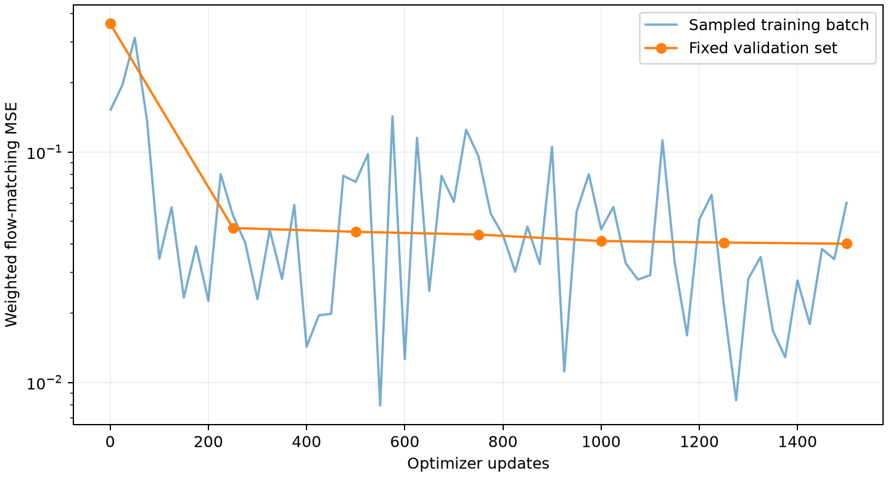
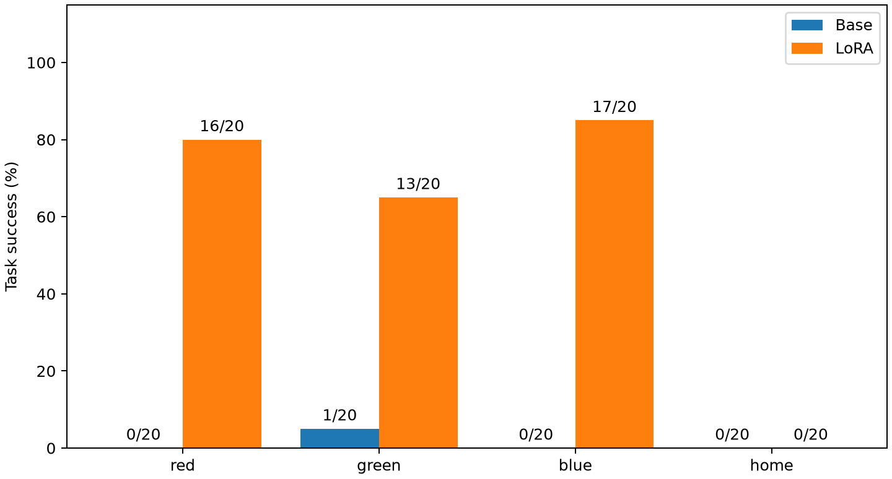

# π0.5 桌面四任务 LoRA 微调报告

本文件记录采集、训练与独立闭环评测。日期：2026-09-28。已完成 448 条示范采集、1500 次 LoRA 更新，以及原始模型和微调模型各 80 次独立测试。三色抓取明显提升，回位本轮尚未学会。

## 1. 任务定义与边界

1. 抓起红色积木并保持夹持。
2. 抓起绿色积木并保持夹持。
3. 抓起蓝色积木并保持夹持。
4. 空夹爪从不同可达位置、朝向回到重置后记录的末端位置和朝向，并保持张开。

“任意位置”在本轮指明确的有限采样范围，不承诺全机器人可达空间。回位起点通过真实控制运动生成：世界坐标 X∈[-0.13,0.13] m、Y∈[-0.22,0.22] m、Z∈[0.93,1.13] m；相对初始姿态的旋转向量各分量范围为 X/Y∈[-0.12,0.12] rad、Z∈[-0.5,0.5] rad。目标为初始末端位姿，不要求冗余关节角逐一完全相同。回位任务不包含携物返回或释放物体。

## 2. 场景与数据

| 项目 | 设置 |
| --- | --- |
| 模拟器 | robosuite 1.5.2 / MuJoCo 3.3.7 |
| 机器人 | Panda，双指夹爪 |
| 场景 | 0.8×0.8 m 桌面，高 0.8 m；红绿蓝积木边长 0.04 m |
| 物体初始化 | X∈[-0.10,0.10] m，Y∈[-0.16,0.16] m，避免初始碰撞 |
| 控制 | OSC 位姿增量，20 Hz；平移每单位 0.05 m，旋转每单位 0.5 rad；夹爪 -1 张开 / +1 闭合 |
| 图像 | agentview + 腕部，各 256×256 RGB；保持底座 LIBERO 旋转 180° 预处理；训练内部缩放到 224×224 |
| 图像存储 | JPEG quality=90，按轨迹 ZIP_STORED 打包 |
| 数据对齐 | 每个动作执行前记录图像及状态，该动作作为当前帧标签 |
| 状态记录 | 世界系末端 XYZ + 四元数转轴角 + 两指关节位置，共 8 维 |
| 示范来源 | 读取仿真真实物体位置的脚本专家，通过夹爪接触动力学完成抓取；部署策略不接收物体位置 |
| 抓取起点 | 约半数采用随机可达位姿，其余从初始位姿出发 |
| 示范结束 | 抓取后保持 20 步；回位后保持 25 步 |
| 失败示范 | 不入训练清单，保留失败原因与独立文件；每个样本最多尝试 10 个种子 |

每任务训练 80 条、验证 12 条、测试 20 条，总计 320/48/80=448 条。三个集合按轨迹和种子隔离，不将相邻视频帧随机拆分到不同集合。训练/验证/测试种子基数分别 10000/20000/30000；任务编号偏移 1000，轨迹编号偏移 10，重试偏移 0–9。随机起点使用 seed+700000。三个集合均保留专家能够完成的场景，失败种子会重试，因此测试分布也受此筛选影响。

实际已完成全部 448 条，完整性检查通过，总计 60,490 帧、120,980 张相机图片。23 次失败尝试未进入合格数据集，采集进程两段累计约 957.46 秒。采集曾在磁盘剩余空间低于 8.5 GiB 时自动停止；空间恢复后从清单继续，不删除旧实验。重试后接受的实际种子、每条长度和初始目标姿态见 [数据清单](lora/dataset-manifest.json)，全部 ZIP 的 SHA-256 见 [完整性报告](lora/dataset-audit.json)。

| 任务 | 训练帧 | 验证帧 | 测试帧 |
| --- | ---: | ---: | ---: |
| 红块抓取 | 12,005 | 1,771 | 3,190 |
| 绿块抓取 | 12,198 | 1,758 | 3,010 |
| 蓝块抓取 | 12,252 | 1,911 | 2,975 |
| 回位 | 6,646 | 1,068 | 1,706 |
| 合计 | 43,101 | 6,508 | 10,881 |

抓取验收：目标块中心 Z>0.90 m、双指接触抓持为真、物体速度<0.04 m/s。回位验收：末端位置误差<0.015 m、朝向误差<0.10 rad、两指关节位置差>0.06 m。闭环评测需连续 10 个控制步满足条件。

## 3. 底座与 LoRA

| 参数 | 首轮设置 |
| --- | --- |
| 底座 | RLinf/RLinf-Pi05-LIBERO-SFT |
| revision | 45ccfcc4e28634f1576ebf78cab0fbe2fd82432d |
| 配置 | pi05_libero，pi05=True，action_horizon=10，discrete_state_input=False |
| 模型结构 | PaliGemma gemma_2b + gemma_300m 动作专家；内部 action_dim=32，有效动作维 7；max_token_len=200 |
| RLinf commit | db66ac56d1aa4a9c8441c4026e4212b21811970d |
| 运行库 | rlinf-openpi 0.1.1 / PyTorch 2.11.0+cu130 / 已补丁 Transformers 4.57.6 / PEFT 0.21.0 |
| LoRA rank / alpha | 16 / 32，缩放 alpha/r=2 |
| LoRA dropout / bias | 0 / none |
| 注入模块 | 动作专家每层 q/k/v/o 投影、gate/up/down MLP；action_in/out_proj、time_mlp_in/out |
| 冻结部分 | 所有原始权重，包括视觉编码器、语言模型及动作专家底座；仅 LoRA A/B 矩阵可训练 |
| 参数精度 | 沿用底座选定参数 BF16，其余 FP32；LoRA 也按所注入层使用混合 BF16/FP32，AdamW 一、二阶矩跟随各参数 dtype；无量化、无 FP32 master weights |
| 归一化 | 复用底座 physical-intelligence/libero/norm_stats.json，quantile 方式；不使用测试集统计；完整数值见 [归一化参数](lora/base-norm-stats.json) |

这个配置的 π0.5 不将本体状态编码为 token，π0.5 动作专家也没有 π0 的 state_proj 分支，因此虽然接口保留状态，当前模型决策主要以双相机和语言为条件。没有静默更改底座结构。状态用于验收、日志和未来适配。

## 4. 训练参数与方法

| 参数 | 首轮设置 |
| --- | --- |
| 训练类型 | 监督行为克隆，flow-matching；不是 PPO / 在线强化学习 |
| 优化步数 | 1500 次 optimizer update |
| micro batch / 累积 / effective batch | 8 / 1 / 8 |
| 优化器 | AdamW，betas=(0.9,0.95)，eps=1e-8，weight_decay=0.01 |
| 峰值学习率 | 1e-4 |
| 学习率计划 | 前 100 步线性 warmup，之后 cosine 衰减到峰值的 10% |
| 梯度裁剪 | 全部可训练参数的总范数上限 1.0；非有限损失/梯度立即报错 |
| 随机种子 | Python / NumPy / Torch 均 42 |
| 噪声 | N(0,1)，与 10×32 padded action 同形状 |
| 时间采样 | Beta(1.5,1.0)×0.999+0.001 |
| 训练目标 | x_t=t·noise+(1-t)·action；预测 noise-action |
| 损失 | 仅前 7 个有效动作维度的 MSE；XYZ/旋转各权重 1，夹爪权重 2，按权重总和 8 归一化；不计算 padding 维度损失 |
| 轨迹采样 | 均匀抽轨迹；每任务示范数相同，因此任务期望均衡 |
| 帧采样 | 抓取轨迹张开/闭合阶段各 50% 概率，再在阶段内均匀抽帧；回位轨迹均匀抽帧 |
| 动作块 | 当前帧起未来 10 步，轨迹末尾重复最后动作补齐 |
| 图像增强 | 无几何/颜色随机增强，避免在四任务初轮中改变颜色语义 |
| 语言增强 | 每任务随机选择 3 种英文同义指令；验证/测试使用固定规范指令 |
| 验证周期 | 每 250 个更新及训练结束 |
| 验证样本 | 每条验证轨迹等距取 4 帧，合计 192 帧；噪声种子固定 2026 |
| 模型选择 | 依据验证 flow loss 选择 best；测试集不参与选取 |
| 保存内容 | best/last LoRA、最后优化器状态及随机数状态、配置与训练曲线；不复制 7.47 GB 底座 |
| 推理 | 10 次 Euler 去噪，预测 10 步，执行前 5 步后重新观察 |

为减少显存，冻结的视觉/语言前缀在 no_grad 下计算 KV，反向传播仅经过动作专家和 LoRA；视觉/语言前缀使用 SDPA，动作后缀使用 eager attention。不启用 torch.compile。冻结前缀不能关注动作后缀，因此这个拆分不切断可训练动作模块的梯度。

训练的步数是梯度更新次数，和仿真 20 Hz 控制步不同。1500×8=12000 个抽样动作块；抽样允许重复，不能称为完整训练 12000 条独立轨迹。

抓取指令模板为 `pick up the {color} cube`、`Pick up the {color} block`、`grasp and lift the {color} cube`；回位模板为 `return to the initial end effector position and orientation with the gripper open`、`return to the initial position`、`move the arm back to its starting pose`。网页中的中文经 Qwen 翻译后交给 π0.5，训练本身使用上述英文模板。

小规模梯度检查：4 条示范训练、另 2 条早期示范只验证链路，2 次更新，梯度范数 0.153，峰值分配显存 8.46 GiB。可训练参数 7,029,760，总参数含 LoRA 为 3,623,787,280，可训练比例约 0.194%。该检查不是正式模型，也不用于测试集结果。过程中修正了 SDPA mask 与查询 dtype 不一致、归一化标签 float64 与模型 float32 不一致的问题。

正式训练已完成 1500 次更新，训练循环及周期验证共 1052.19 秒（约 17.54 分钟，包含约 100 秒调度暂停，不含初始模型加载与首次验证）。最终和最优验证损失均为 0.0400116，初始为 0.360917，降低约 88.9%。最优 adapter 来自第 1500 步，选择过程未使用测试成功率。训练进程的峰值 CUDA 张量分配为 8.492 GiB；这不是整个 GPU 的总占用，卡上还有 Qwen 和独立评测进程。

保存产物的实际 dtype 已核对：6,930,432 个 LoRA 参数为 BF16，99,328 个动作/时间投影 LoRA 参数为 FP32，优化器动量同样按此分组。详见 [精度核对](lora/precision-audit.json)。这可能限制低学习率阶段的小幅更新，是后续优化方向，不能将本轮描述为全 FP32 LoRA 训练。best 与 last 一致，增量文件为 14,296,800 字节（约 13.63 MiB），SHA-256 为 `408992bdedb8192086f02a85e674b354028c1a17127e9c389b3b2077971c1484`；详见 [权重清单](lora/adapter-manifest.json)。

| 更新步数 | 固定验证损失 |
| ---: | ---: |
| 0 | 0.360917 |
| 250 | 0.046838 |
| 500 | 0.045067 |
| 750 | 0.043862 |
| 1000 | 0.041110 |
| 1250 | 0.040497 |
| 1500 | 0.040012 |

完整曲线见 [训练日志](lora/training-history.json)。训练结束标记见 [完成记录](lora/training-complete.json)。LoRA 保存/加载数值往返检查通过；应用层 23 项检查通过。

过程中还对第 250、1000 步的快照各跑了 4 条验证轨迹，分别成功 0/4、1/4，仅用于检查闭环链路，未改动本轮超参数。原始记录见 [250 步检查](lora/validation-250.json)、[1000 步检查](lora/validation-1000.json)。正式测试仍使用按固定验证损失选出的第 1500 步权重。



## 5. 独立闭环评测结果

固定独立测试种子，每任务 20 次，原始底座与 LoRA 使用同一初始化、同一指令和成功判据。单任务最多 250 个控制步。记录各任务成功数、夹爪闭合次数、结束状态、耗时和示例视频。测试时不调用专家技能，只在准备随机起点时使用脚本控制。

单项样本量仅 20 次，一次成功或失败就影响 5 个百分点。结果适用于这套固定相机、积木尺寸和初始分布，不代表真实机械臂或更广泛场景的成功率。独立测试使用英文规范指令，中文翻译链路另作网页功能检查。

| 任务 | 原始底座 | LoRA |
| --- | --- | --- |
| 红块抓取 | 0/20（0%） | 16/20（80%） |
| 绿块抓取 | 1/20（5%） | 13/20（65%） |
| 蓝块抓取 | 0/20（0%） | 17/20（85%） |
| 返回初始末端位姿 | 0/20（0%） | 0/20（0%） |
| 四项合计 | 1/80（1.25%） | 46/80（57.5%） |

三色抓取合计从 1/60（1.67%）提升到 46/60（76.67%）。红、绿、蓝仍分别有 4、7、3 次失败，不能称为稳定满分。两组各 80 次测试均无程序异常。

回位为 0/20，不能称为已完成此能力。微调后回位终点的位置误差中位数为 19.80 cm（验收要求 1.5 cm），朝向误差中位数为 1.635 rad（要求 0.10 rad），14/20 条在结束时保持夹爪张开。说明只改善夹爪张开不足以完成回位；位置与姿态都未满足要求。详见 [诊断统计](lora/evaluation-diagnostics.json)。

原始逐条记录：[底座 80 次](lora/baseline-results.json)、[LoRA 80 次](lora/finetuned-results.json)。视频：[红块抓取成功](lora/red-pick-demo.mp4)、[回位失败](lora/home-return-failure.mp4)。所有测试轨迹的动作日志和更多视频留在远程 `runs/lora-baseline/`、`runs/lora-finetuned/`。



本轮只完成一次固定超参数正式训练，没有根据测试结果继续调参。后续优先用验证集补充回位纠偏示范、检查是否需要适配本体状态输入，并单独比较 FP32 LoRA 参数/优化器状态的训练；这些是待验证方向，尚未实施，也不承诺仅增加训练步数就能解决。当前测试集已被查看，后续迭代应另留新的独立测试种子。

## 6. 复现与产物

在远程项目 `/home/zhangweiyao/holmes/tabletop-vla-playground` 执行；本地仅保存源码、可公开报告和少量示例，权重和全量图像不提交 Git。

网页已部署新增“π0.5 LoRA · 红绿蓝抓取与回位”选项，原始 π0.5 仍可切换。完成中文“抓起红色积木”的场景 0 检查：翻译为 `Pick up the red block`，加载第 1500 步 adapter，执行 250 步，无程序错误。首次加载及执行合计 89.84 秒，详见 [网页检查](lora/ui-smoke.json)。这是一条功能检查，不计入上面的独立成功率。网页达到步数上限只表示执行结束，不会自动宣告任务成功；停止按钮仍然有效。

```bash
# 已检查 GPU 后采集；若与本项目现有网页共用卡，可显式加 --share-with-app
TABLETOP_GPU=0 .venv/bin/python scripts/collect_demonstrations.py
.venv/bin/python scripts/audit_demonstrations.py

# 复用已安装 RLinf/openpi 的独立解释器，不修改其环境，也不启动旧 LIBERO 训练
TABLETOP_GPU=0 bash scripts/run_lora_training.sh

# 独立测试，分别运行，避免重复占卡
TABLETOP_GPU=0 .venv/bin/python scripts/evaluate_lora.py --output runs/lora-baseline
TABLETOP_GPU=0 .venv/bin/python scripts/evaluate_lora.py \
  --adapter adapters/tabletop-four-v1/best --output runs/lora-finetuned
```

- 数据：`data/tabletop-four-v1/`。
- 增量权重：`adapters/tabletop-four-v1/{best,last}/adapter.safetensors`。
- 模型版本与训练参数：同目录 `config.json`；完整命令参数和训练配置另见 [training-config.json](lora/training-config.json)。
- 优化器最后状态：`adapters/tabletop-four-v1/optimizer-last.pt`，包含 Torch/CUDA/Python/NumPy 随机数状态。
- 训练曲线：`adapters/tabletop-four-v1/history.json`；完成标记：`complete.json`。
- 运行环境精确版本见 [environment.json](lora/environment.json)，模型结构见 [model-config.json](lora/model-config.json)。显卡报告为 NVIDIA GeForce RTX 4090 / 49140 MiB，驱动 595.71.05；本轮仅使用物理 GPU 0，其他用户的卡和进程未修改。
- 推理进程 Torch 随机种子为 7，按测试顺序消耗去噪随机数；每条场景使用清单中独立的环境种子。
- 现有底座和 Qwen 未覆盖。网页加载原始或 LoRA 时记录相应 adapter 路径、训练 step 及配置，不将两者混为一个模型。
