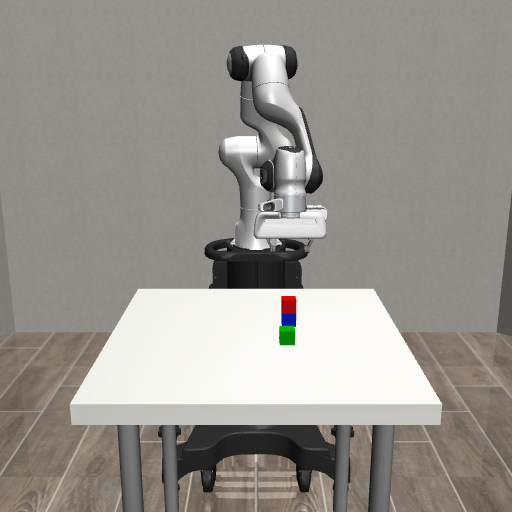

# 验收记录

日期：2026-09-25。执行主机：远程 aigc；所有实验使用单张 GPU 0。旧 LIBERO 实验未恢复。

## 已完成的验证

| 检查 | 结果 |
|---|---:|
| 场景重置、图像、初始放置、相同种子复现 | 20/20 |
| 抓取 | 19/20（95%） |
| 放置到左侧区域 | 19/20（95%） |
| 两块积木堆叠 | 19/20（95%） |
| 结构化输出、动作接口、五技能上限、失败停止、问答不动作 | 15 项通过 |
| 操作中途停止、超时 | 均在第 5 个控制步终止 |
| 锁定依赖的第二个独立环境 | 安装成功，15 项测试通过 |

三个技能的失败均发生在 seed=15、操作红色积木时；接近阶段有 0.012 m 残余位置误差，控制器在移动上限内未到达目标，按失败计分。没有排除该种子、重置重试或修改成功阈值。

物理测试每个技能使用 20 个初始种子（0–19），每次从新场景开始，轮换操作红/绿/蓝。抓取须检测夹持且积木中心高于桌面 0.10 m；放置须水平误差 <0.018 m、高度误差 <0.008 m、线速度 <0.02 m/s 且已松爪。原始记录和视频位于远程 `runs/physics/`。

## 模型验收

Qwen3-VL-8B-Instruct，BF16，固定模型 revision 见 `model.json`；单卡推理与渲染，观察到显存约 17–18 GiB。第二轮在按 `requirements.lock` 重建的独立环境中执行。

| 指标 | 第一轮 | 修正提示词后 |
|---|---:|---:|
| 视觉问答 | 20/30（66.7%） | **28/30（93.3%）** |
| 首次指令解析 | 20/20（100%） | **20/20（100%）** |
| 最终物理完成 | 17/20（85%） | **18/20（90%）** |
| 闭环完整完成 | 17/20（85%） | **18/20（90%）** |

第一轮有 8 次颜色回答使用了英文名称，2 次回答未遵循 JSON 格式；另外一次抓起后模型擅自放下物体。修正系统提示，明确中文回答、JSON 格式和完成指令后停止追加动作，再运行相同测试集；没有训练模型或调整物理成功阈值。

最终颜色和数量各 10/10，左右关系 8/10。失败的左右问题是 seed=100、108，模型把“右”判断成“左”。操作失败为 seed=208（蓝色放左侧）、219（绿色叠红色），控制器接近物体时分别有 0.013 m、0.012 m 残余位置误差。达到计划的 18/20 操作验收线，但拥挤布局和左右关系仍有局限。

问答种子 100–109，每个场景三个问题；指令种子 200–219，包含抓取、左右区域放置和双积木堆叠。两轮都是同一套开发验收用例，不是未见测试集的泛化结果。逐例输入、输出与物理结果保存在 `vlm-cases.json`，第一轮保存在 `vlm-v1-cases.json`。

网页实测通过：中文颜色问答、红色叠蓝色、场景重置、即时停止。停止后记录为“用户已停止”，没有继续执行后续技能。15 项单元测试和运行中第 5 步停止/超时测试均通过。

物理堆叠演示见 [stack-demo.mp4](stack-demo.mp4)，完整交互视频保存在远程各次 `runs/<时间>/video.mp4`。

说明：这些结果是三个固定颜色积木场景中的工程验收，不是端到端 VLA 或通用机器人 benchmark。问答只用图像；技能执行器使用仿真真实物体位置。
